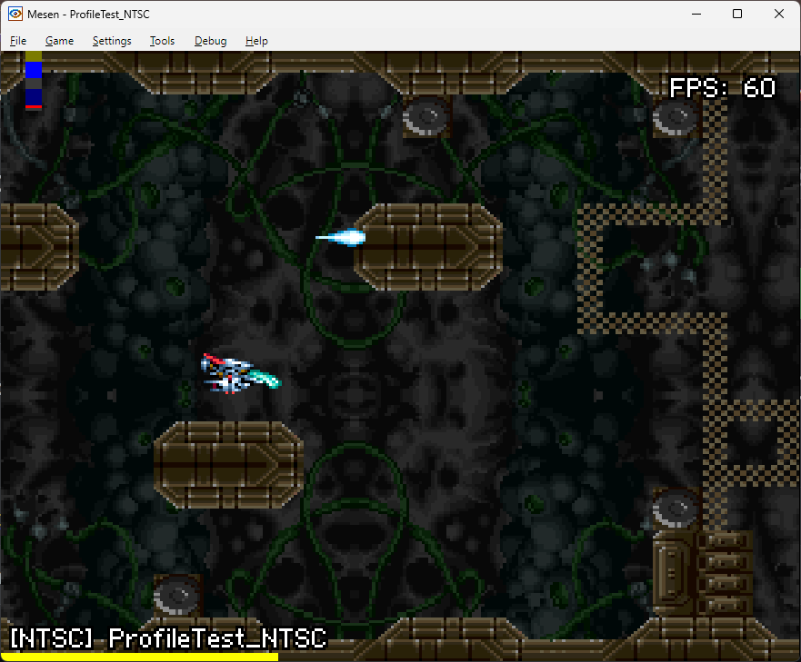

# SNES-Profiler
A very simple profiler for SNES code

Written for use with the fantastic PVSNESLIB:  https://github.com/alekmaul/pvsneslib

How it works:

usage:

Example in game:

ToDo:

Need a simple system to profile code in VBlank and display that. 
~~Also some handy "WaitTilScanlineZero" code would be great.~~
