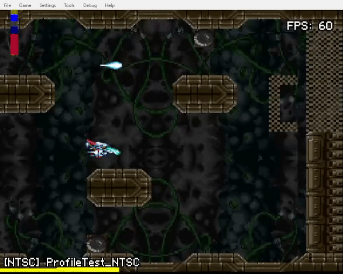

# SNES-Profiler
A very simple profiler for SNES code

Written for use with the fantastic PVSNESLIB:  https://github.com/alekmaul/pvsneslib

**How it works:**


**Usage:**

This is the code from the ProfileNTSC.sfc example

```
	InitProfiler();
	setScreenOn();

	while (1)
	{
		StartProfiler();
		ProfileColour(profOLIVE);
		CameraUpdate();

		ProfileColour(profBLUE);
		ShipUpdate(0);

		ProfileColour(profGREY);
		oamDynamic32Draw(PlayerShip);
		oamDynamic16Draw(TestSprite);

		ProfileColour(profDARKBLUE);
    		SpritePathFollow();    
		bgSetScroll(1, CameraXPos >> 6, 0);

		ProfileColour(profRED);
		mapUpdate();

		ProfileColour(profGREY);
		oamInitDynamicSpriteEndFrame();
		ProfilerOff();

		VBlankProfile(); // must put this here, profile any vblank cpu usage
		WaitForVBlank();

		oamVramQueueUpdate(); // uploads any sprite tiles needed
		mapVblank(); // Draws the map
	}
```

**Example in game:**

The bar colours are from the code above. The yellow bar is the VBlank code usage - where full screen width equals all VBlank cpu time. (it's not very accurate tho)



ToDo:
Audio profiling? - ugh lol!
~~Need a simple system to profile code in VBlank and display that.~~ 
~~Also some handy "WaitTilScanlineZero" code would be great.~~
